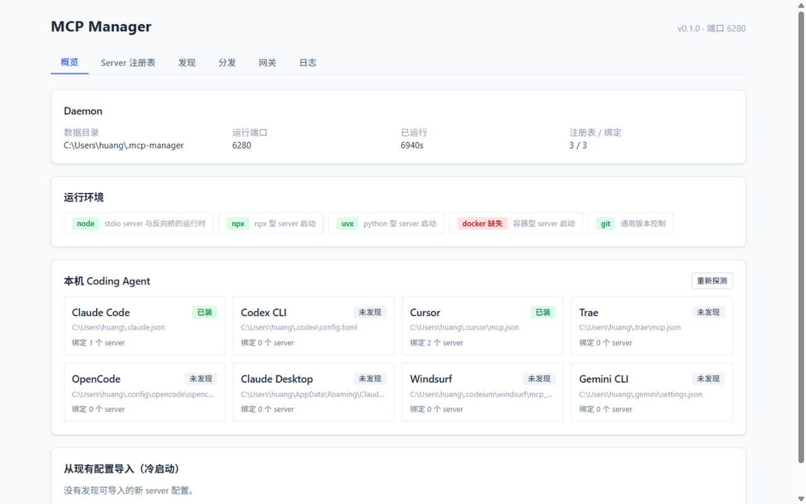
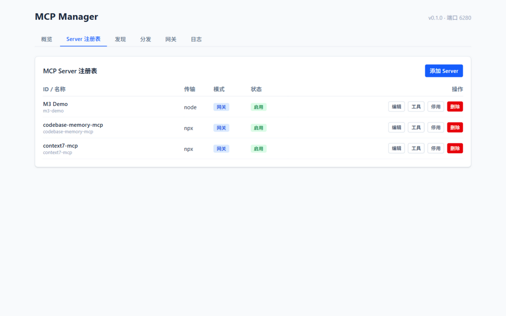
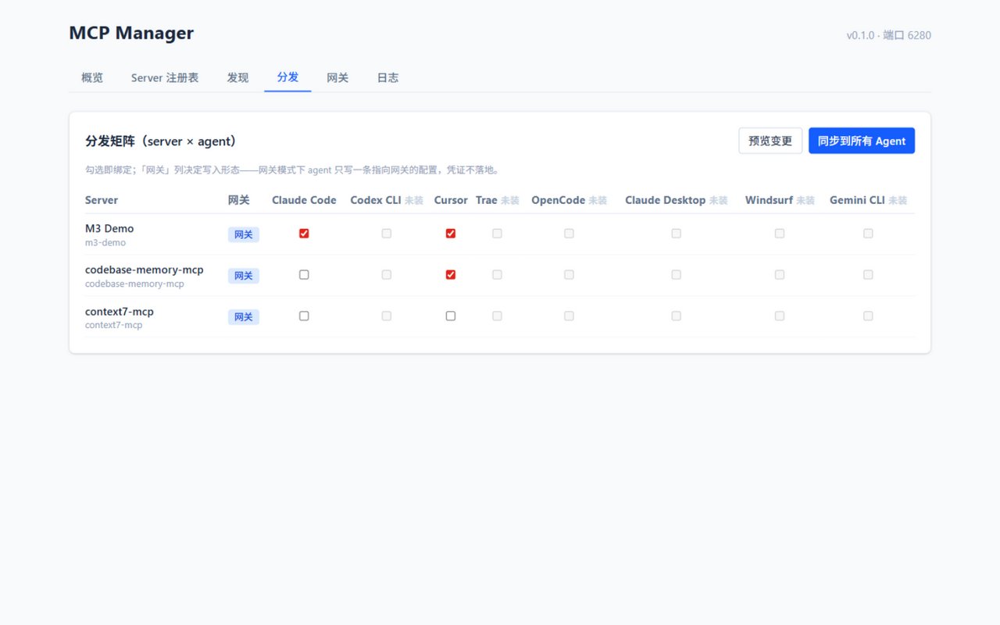
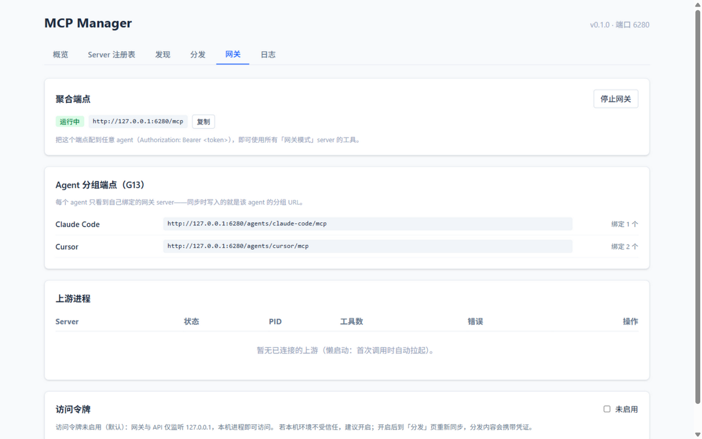
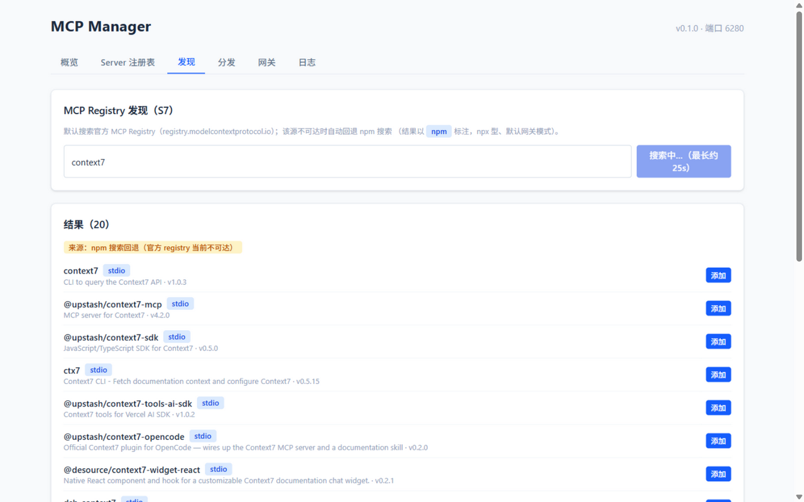
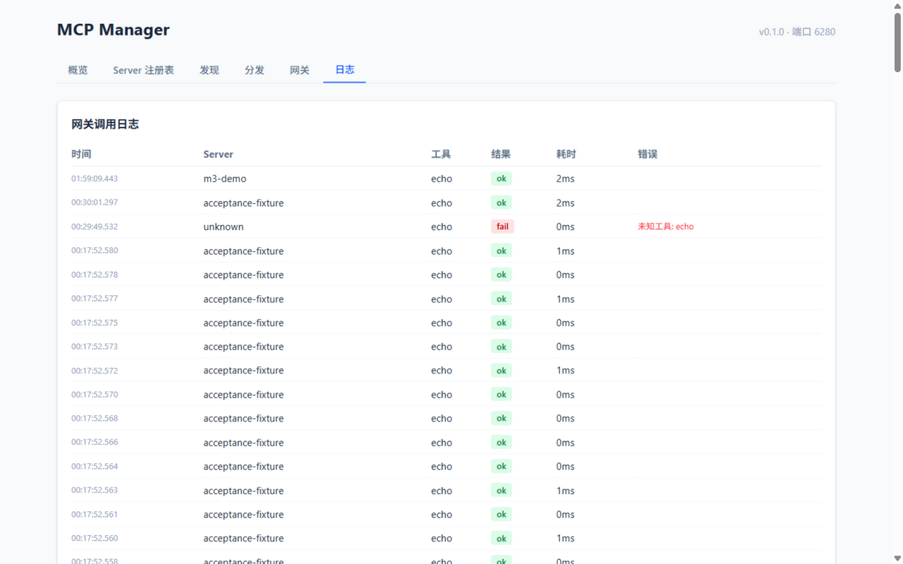

# MCP Manager

[](https://github.com/hxgh776/mcp-manager/actions/workflows/ci.yml)


面向开发者个人电脑的 **MCP 控制平面**：MCP Server **配置一次，多个 AI Coding Agent 一键启用**；可选网关模式统一聚合、代理、过滤与观测所有 MCP 流量。

支持 **8 个 Agent**：Claude Code · Codex CLI · Cursor · Trae · OpenCode · Claude Desktop · Windsurf · Gemini CLI

## ✨ 界面一览

| 概览（Agent 探测 / 运行环境 / 导入） | Server 注册表 |
|---|---|
|  |  |

| 分发矩阵（server × agent 勾选即同步） | 网关（聚合端点 / 上游进程） |
|---|---|
|  |  |

| Registry 发现（一键添加） | 调用日志 |
|---|---|
|  |  |

## 🤔 为什么需要它

如果你的机器上装了多个 AI Coding Agent，你大概率遇到过：

- **同一个 MCP server 要配置 N 遍**——Claude Code 用 JSON、Codex 用 TOML、Cursor 又是另一个文件，改一处要改 N 处，极易不同步；
- **API Key 散落在每个 agent 的配置文件里**，轮换密钥 = 手改 N 个文件；
- **工具一多上下文爆炸**，却只能整体开关，没法精细控制每个 agent 看到哪些工具；
- **出了问题无从排查**——stdio 进程日志散落在各 agent 的缓存目录里。

MCP Manager 把所有 MCP Server 收进**单一注册表**，然后二选一（可混搭）地分发：

| | 直连模式 | 网关模式 |
|---|---|---|
| 原理 | 把真实配置写进各 agent | agent 只写一条指向本地网关的 URL |
| 凭证 | 随配置复制到各 agent | **只在本地一份，不落地 agent 配置** |
| 工具过滤 | 受 agent 能力限制 | 网关层工具级开关，改完即刻生效 |
| 进程 | 各 agent 各自拉起 | 全部 agent 共享一份进程 |
| 适合 | 本地文件/终端类 server | 远程 API 类、工具多的 server |

Codex 这类只支持 stdio 的 agent 也没问题——内置 **stdio 反向桥**，让它们同样能用上网关和远程 HTTP server。

## 🚀 快速开始

**前置要求**：Node.js ≥ 20（`npx`/`uvx`/`docker` 按需）、pnpm ≥ 9。

```bash
# 1. 获取并构建
git clone https://github.com/hxgh776/mcp-manager.git
cd mcp-manager
pnpm install && pnpm build

# 2. 启动 daemon（后台常驻）
node packages/cli/dist/index.js start
#   API/UI: http://127.0.0.1:6280
#   MCP   : http://127.0.0.1:6280/mcp

# 3. 打开管理界面
#    浏览器访问 http://127.0.0.1:6280 —— 默认无需令牌
```

**5 分钟上手路径**：

1. 打开「概览」页 → 自动探测本机 agent，并把现有 MCP 配置**导入**注册表；
2. 「发现」页搜索（如 `context7`）→ 一键以网关模式添加；
3. 「分发」页勾选要启用它的 agent → **同步**；
4. 完成。此后改配置/换密钥/开关工具都只在这一处，同步一下全局生效。

## 🖥 CLI

```bash
mcpmgr start | stop | status
mcpmgr servers list | servers add --name X --transport stdio --command npx --args ...
mcpmgr agents            # 探测本机 agent
mcpmgr import [--all]    # 从现有 agent 配置导入
mcpmgr sync [--dry-run]  # 分发到各 agent
mcpmgr gateway status | start | stop
mcpmgr bridge <url> --token xxx   # stdio 反向桥（供 stdio agent 连远程端点）
```

## 🤖 支持的 Agent

| Agent | 配置文件 | 网关模式 |
|---|---|---|
| Claude Code | `~/.claude.json` | ✅ 原生 |
| Codex CLI | `~/.codex/config.toml` | ✅ 经内置反向桥 |
| Cursor | `~/.cursor/mcp.json` | ✅ 原生 |
| Trae | `~/.trae/mcp.json` | ✅ 原生 |
| OpenCode | `~/.config/opencode/opencode.json` | ✅ 原生 |
| Claude Desktop | 分平台 `claude_desktop_config.json` | ✅ 原生 |
| Windsurf | `~/.codeium/windsurf/mcp_config.json` | ✅ 原生 |
| Gemini CLI | `~/.gemini/settings.json` | ✅ 原生 |

> 写入保真承诺：只动 MCP 配置键，写入前自动备份、原子写入、写后校验；你在配置里的手工修改会被检测并交给你决定，绝不静默覆盖。

## 🧰 核心能力

- **配置分发**：注册表为单一事实来源，勾选矩阵分发，支持冲突检测与 dry-run 预览；
- **MCP 网关**：多上游聚合成一个 streamable HTTP 端点；工具级开关、重名自动加前缀；上游懒启动、崩溃自愈（指数退避）；per-agent 分组端点让每个 agent 只看到自己的工具子集；
- **协议桥接**：stdio ↔ streamable HTTP / SSE 双向兼容，老协议 server 和老协议 agent 都能接入；
- **服务管理**：进程启停/重启、stderr 日志、调用日志（含耗时与错误）、工具调试台（不经 agent 直接调用）；
- **安全**：默认仅监听 127.0.0.1；访问令牌默认关闭、可在界面开启；上游凭证静态加密（Windows DPAPI），网关模式下不落地 agent 配置。

## 📚 文档

- [需求分析](docs/requirements-analysis.md)
- [实施方案](docs/implementation-plan.md)
- [验收报告](docs/acceptance-report.md)（含性能与安全实测数据）

## 🛠 开发

```bash
pnpm install
pnpm build        # 构建 core / server / cli / web
pnpm test         # 67 个单元 + 集成测试（含真实子进程网关全链路）
pnpm lint
cd e2e && pnpm i && npx playwright install chromium && pnpm test
```

> 所有自动化测试通过沙箱目录重定向，**绝不读写真实 agent 配置**。

## 🗺 Roadmap

- [ ] 项目级作用域（per-project 分发）
- [ ] VS Code 适配器
- [ ] macOS Keychain / Linux libsecret 凭证加密
- [ ] 发布到 npm（`npx mcp-manager` 直接使用）

## 📄 License

[MIT](LICENSE)
